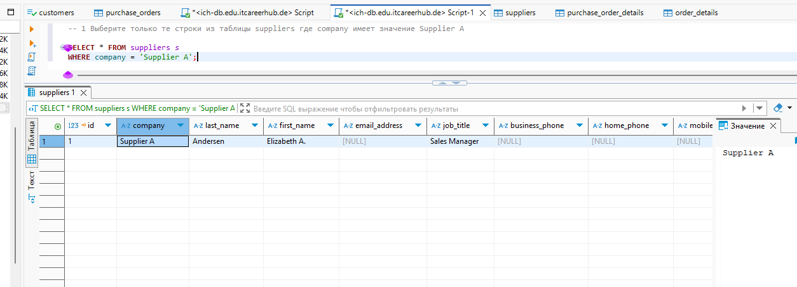
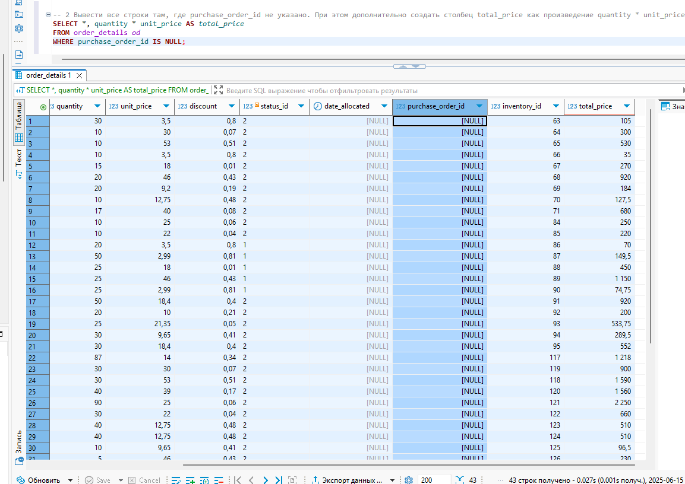
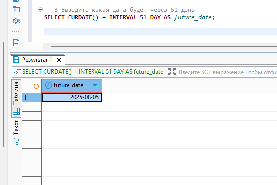
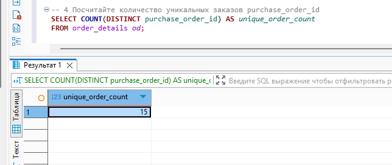
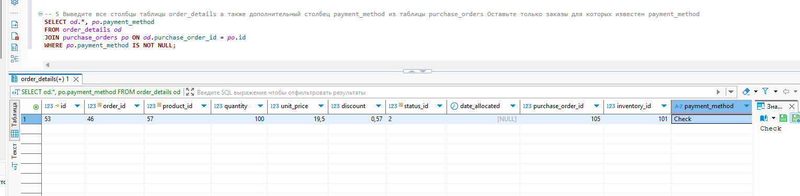

# Web engineering 2025: Домашнее задание 13

## Все запросы пишем в интерфейсе DBeaver

### Задание 1. Выберите только те строки из таблицы suppliers где company имеет значение Supplier A

### Задание 2. Вывести все строки там, где purchase_order_id не указано. При этом дополнительно создать столбец total_price как произведение quantity * unit_price

### Задание 3. Выведите какая дата будет через 51 день

### Задание 4.  Посчитайте количество уникальных заказов purchase_order_id

### Задание 5. Выведите все столбцы таблицы order_details а также дополнительный столбец payment_method из таблицы purchase_orders. Оставьте только заказы для которых известен payment_method

