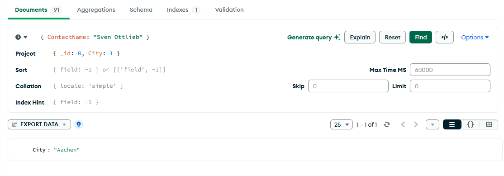
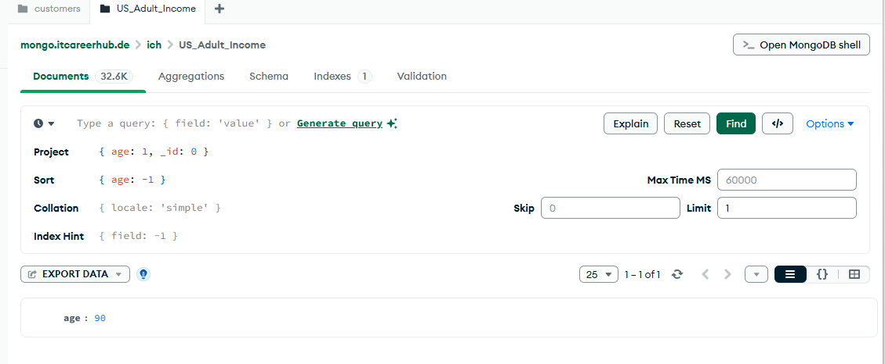
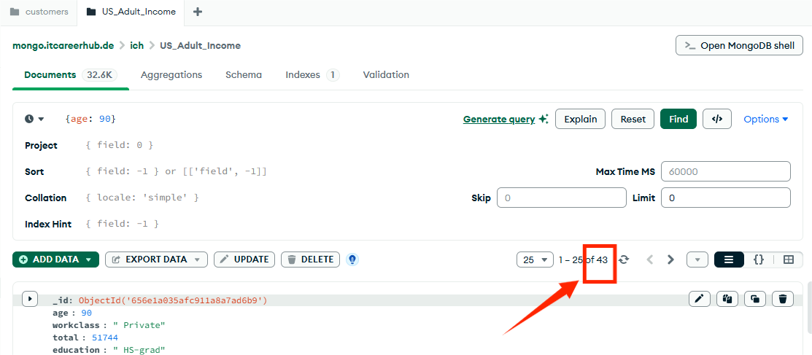
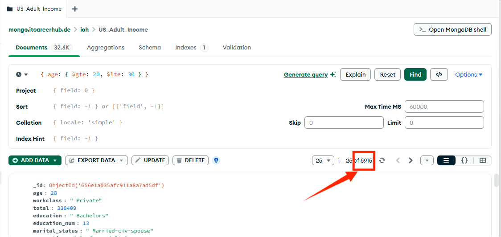

# Web engineering 2025: Домашнее задание 14

## MongoDB

### Задание 1. Из коллекции customers выяснить из какого города "Sven Ottlieb"

### Задание 2. Из коллекции ich.US_Adult_Income найти возраст самого взрослого человека

### Задание 3. Из 2 задачи выясните, сколько человек имеют такой же возраст

### Задание 4.  Найти _id ObjectId документа, в котором education " IT-career-hub"

### Задание 5. Выяснить количество людей в возрасте между 20 и 30 годами

