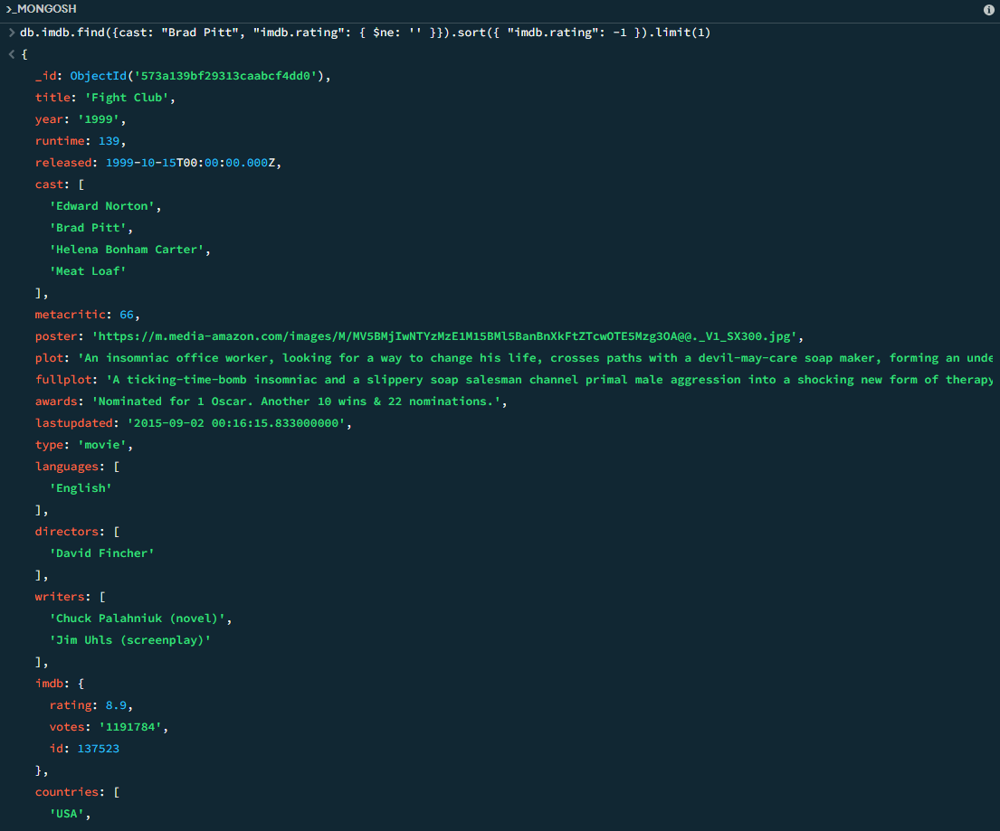

# Web engineering 2025: Домашнее задание 15

## MongoDB

### Задание 1. Коллекция imdb : Используя оператор $size , найдите фильмы, написанные 3 сценаристами (writers) и снятые 2 режиссерами (directors)

```js
db.imdb.find({ writers: { $size: 3 }, directors: { $size: 2 }})
```


### Задание 2. Коллекция bookings: Найдите адрес нахождения автомобиля с vin WME4530421Y135045 по самой последней дате (и времени) final_date

```js
db.bookings.find({ vin: "WME4530421Y135045" }).sort({ final_date: -1 }).limit(1)
```


### Задание 3. Коллекция bookings: подсчитайте, у скольких автомобилей при окончании аренды закончилось топливо (final_fuel)

```js
db.bookings.countDocuments({ final_fuel: 0 })
```


### Задание 4.  Коллекция bookings: найдите номерной знак и vin номер авто, с самым большим километражом (distance)

```js
db.bookings.find({}, { _id: 0, plate: 1, vin: 1, distance: 1 }).sort({ distance: -1 }).limit(1)
```


### Задание 5. Коллекция imdb. Найдите фильм с участием "Brad Pitt" с самым высоким рейтингом (imdb.rating)

```js
db.imdb.find({cast: "Brad Pitt", "imdb.rating": { $ne: '' }}).sort({ "imdb.rating": -1 }).limit(1)
```




