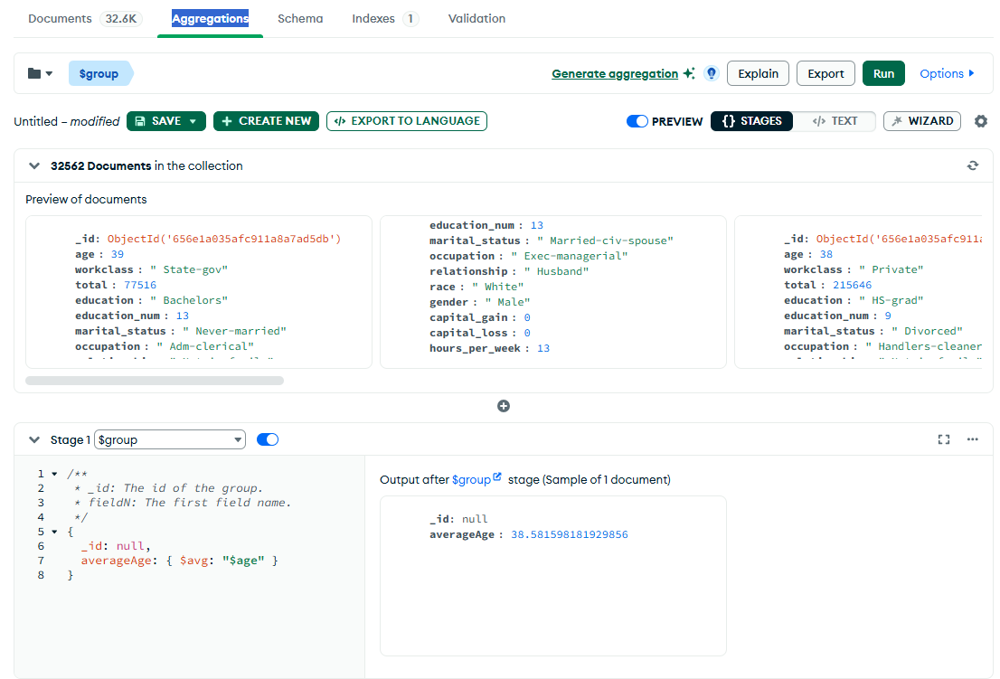
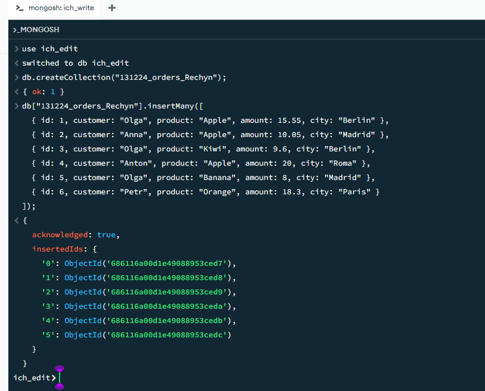
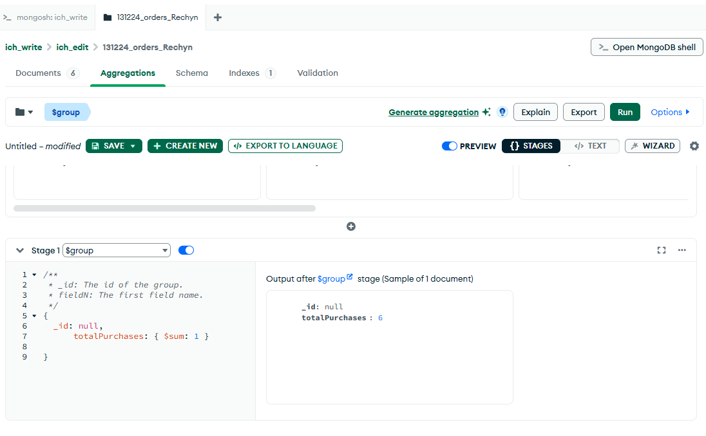
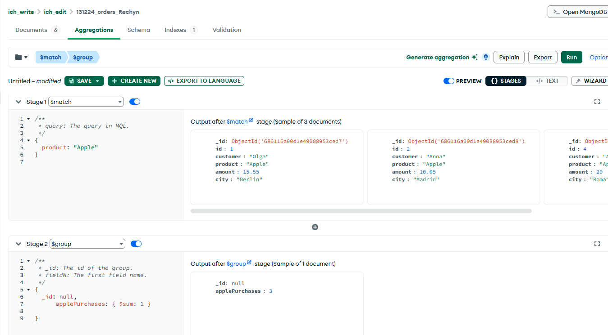
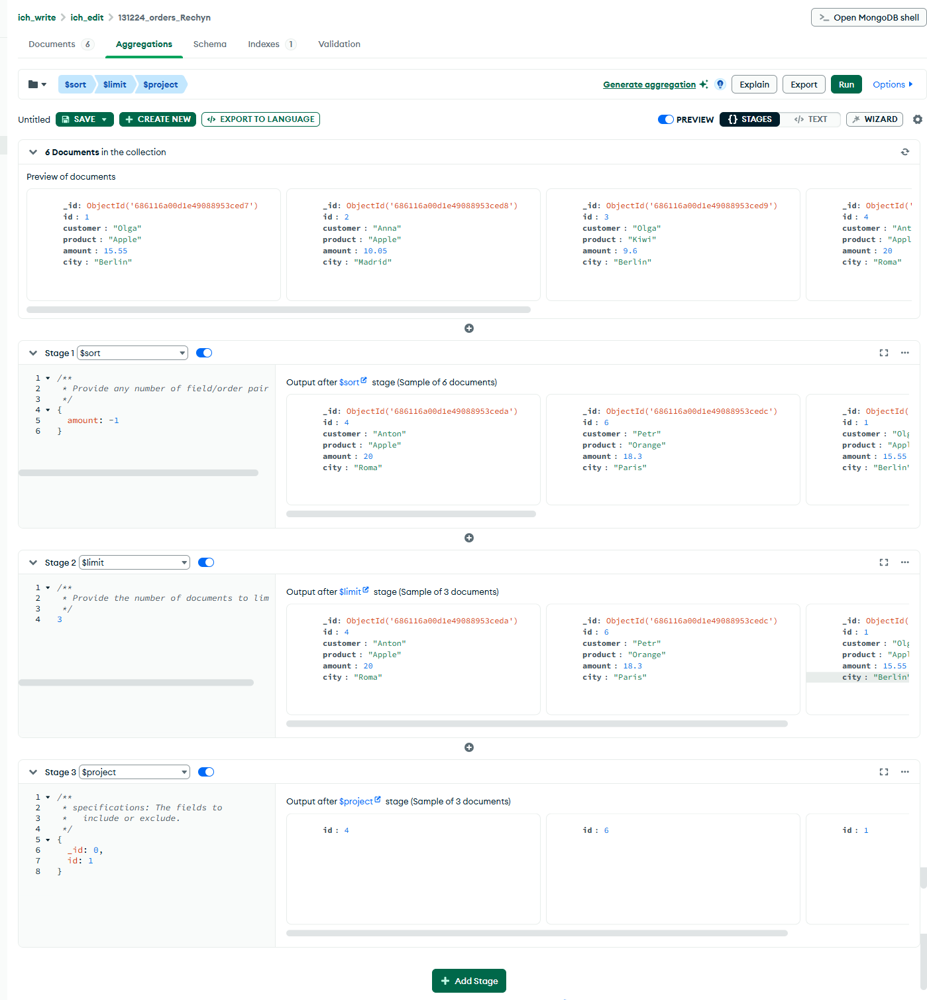
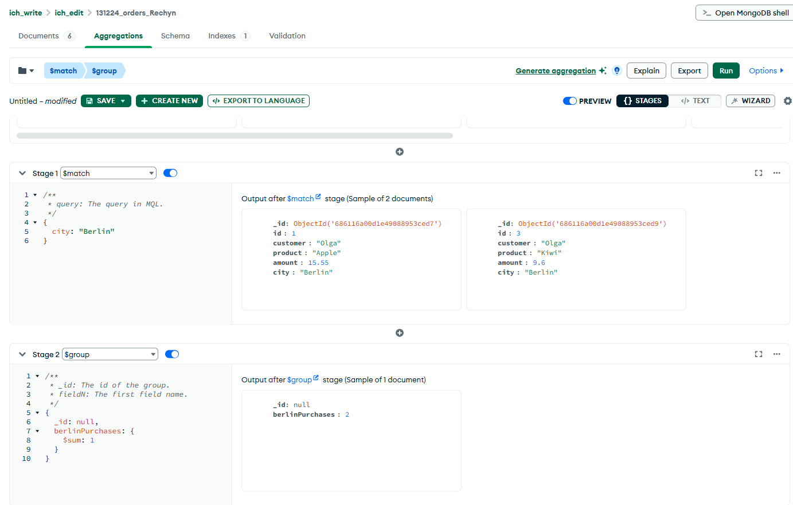
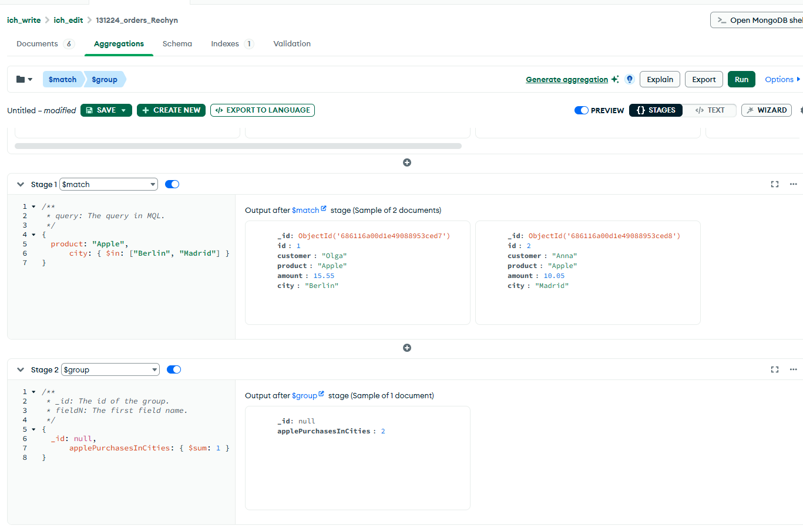
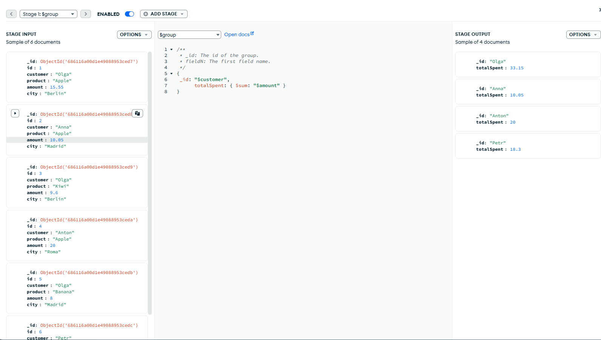
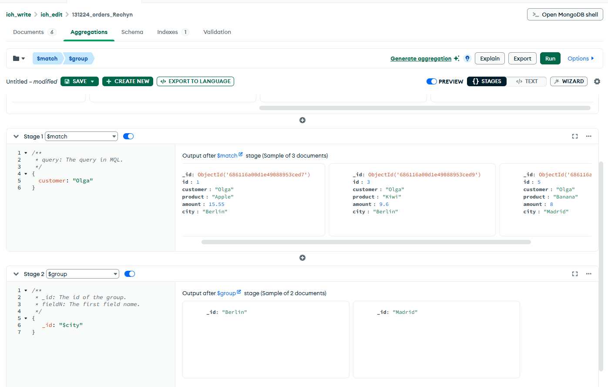

# Web engineering 2025: Домашнее задание 16

## MongoDB: Создание и наполнение коллекций. Агрегация.

### Задание 1. Найдите средний возраст из коллекции ich.US_Adult_Income

### Задание 2. Поменяв подключение к базе данных, создать коллекцию orders_NAME (для уникальности - добавим ваше имя в название) со свойствами id, customer, product, amount, city

### Задание 3. Найти сколько всего было совершено покупок

### Задание 4.  Найти сколько всего раз были куплены яблоки

### Задание 5. Вывести идентификаторы трех самые дорогих покупок

### Задание 6.  Найти сколько всего покупок было совершено в Берлине

### Задание 7. Найти количество покупок яблок в городах Берлин и Мадрид

### Задание 8.  Найти сколько было потрачено каждым покупателем

### Задание 9. Найти в каких городах совершала покупки Ольга

