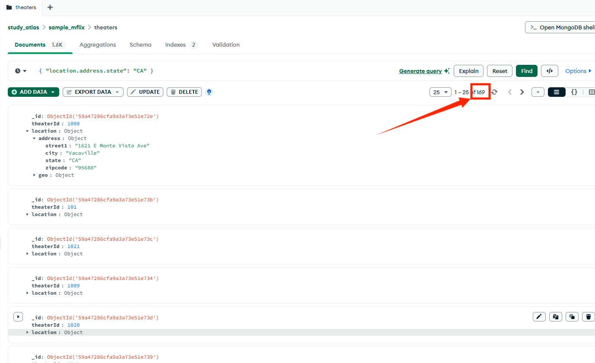
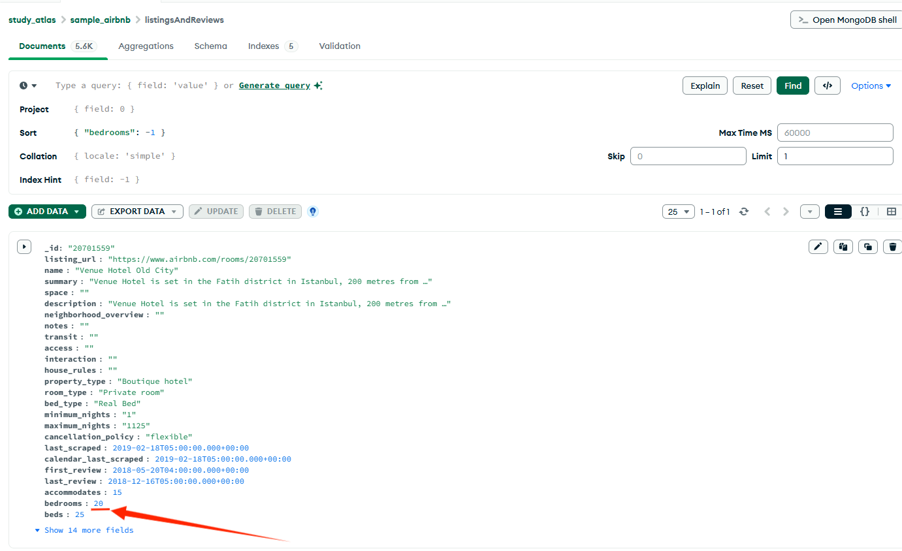
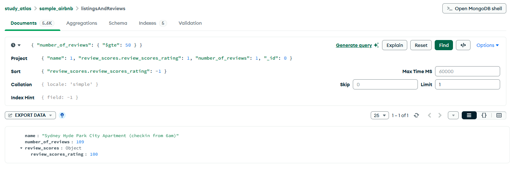

# Web engineering 2025: Домашнее задание 17

## MongoDB Atlas. Индексы. Наполнение коллекций.

### Задание 1. Тестовая коллекция в mongo atlas  sample_mflix.theaters. Найти все кинотеатры в Калифорнии и посчитать их количество

### Задание 2. Тестовая коллекция в mongo atlas  sample_airbnb.listingsAndReviews. Найти недвижимость с самым большим количеством спален (bedrooms) и напишите ее название

### Задание 3. Тестовая коллекция в mongo atlas  sample_airbnb.listingsAndReviews. Найти недвижимость с самым высоким рейтингом  review_scores_rating при минимальном количестве отзывов 50 (number_of_reviews) и напишите ее название

 

 

