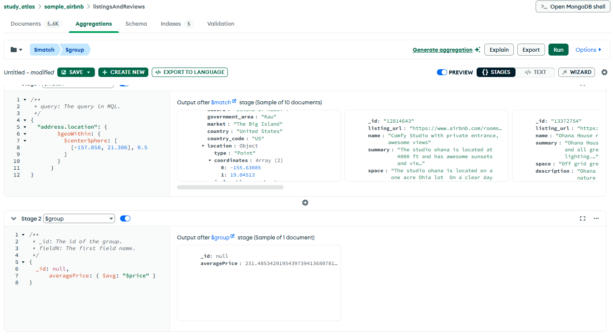
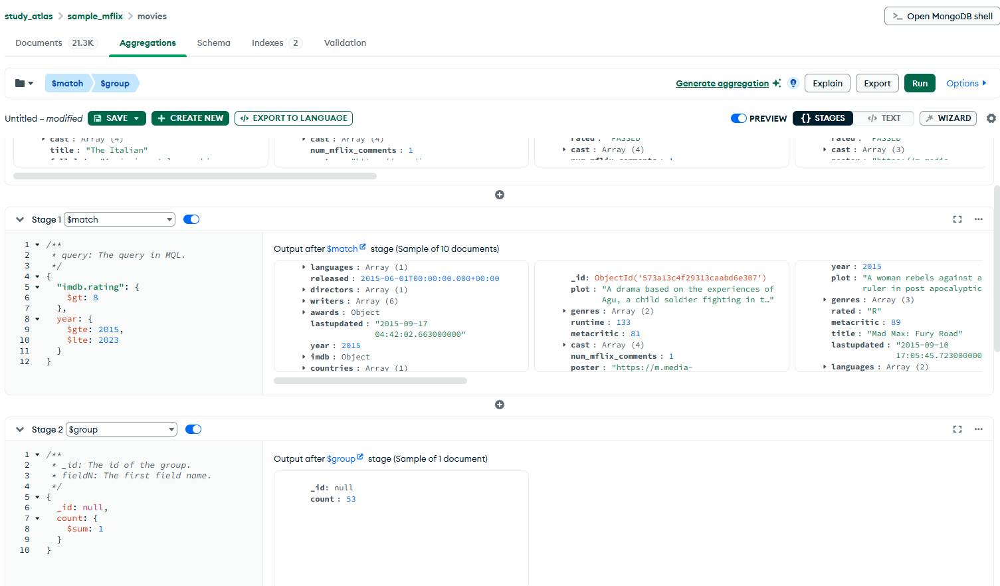
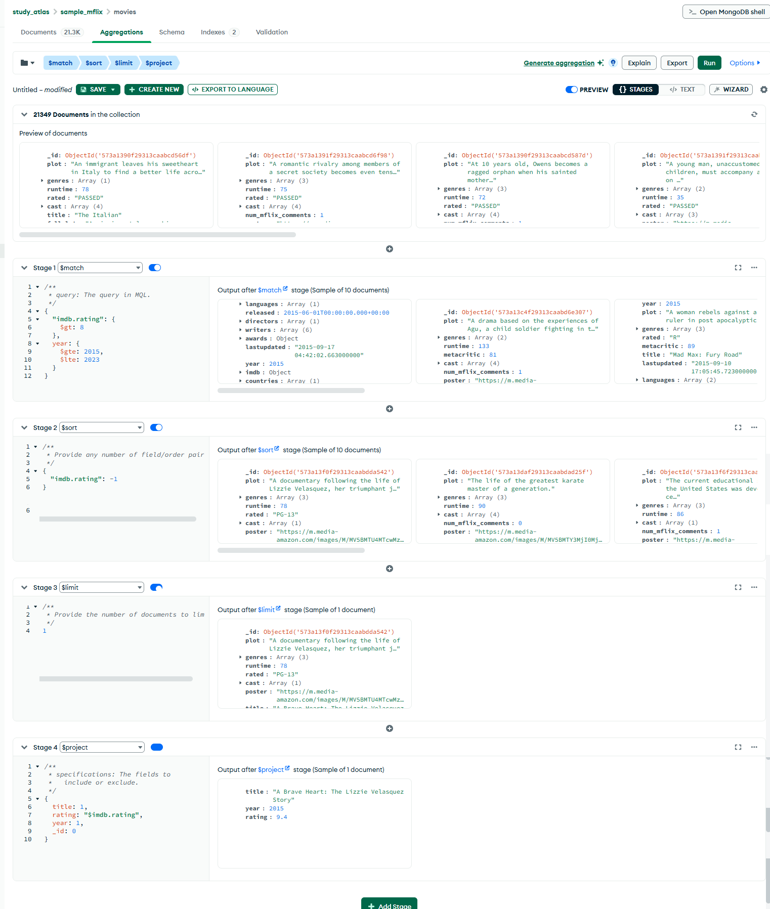

# Web engineering 2025: Домашнее задание 18

## MongoDB. Репликация и CAP теорема.

### Задание 1. Из коллекции sample_airbnb.listingsAndReviews найдите среднюю цену за сутки проживания на Гавайских островах. Островов несколько, поэтому либо используем {'address.location': {$geoWithin: { $centerSphere …. Либо перечисляем все возможные острова в поле market. Подсказка - нам понадобится 2 этапа агрегации : $match и $group

### Задание 2. Подсчитайте в коллекции sample_mflix.movies, сколько фильмов имеют imdb рейтинг выше 8 и выходили в период с 2015 до 2023 года (используем year) Какой из них имеет самый высокий рейтинг ?

 

 

2. 