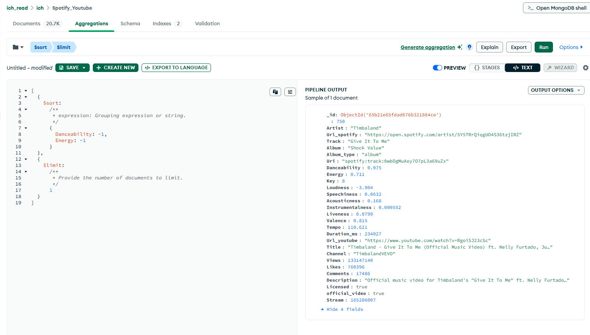
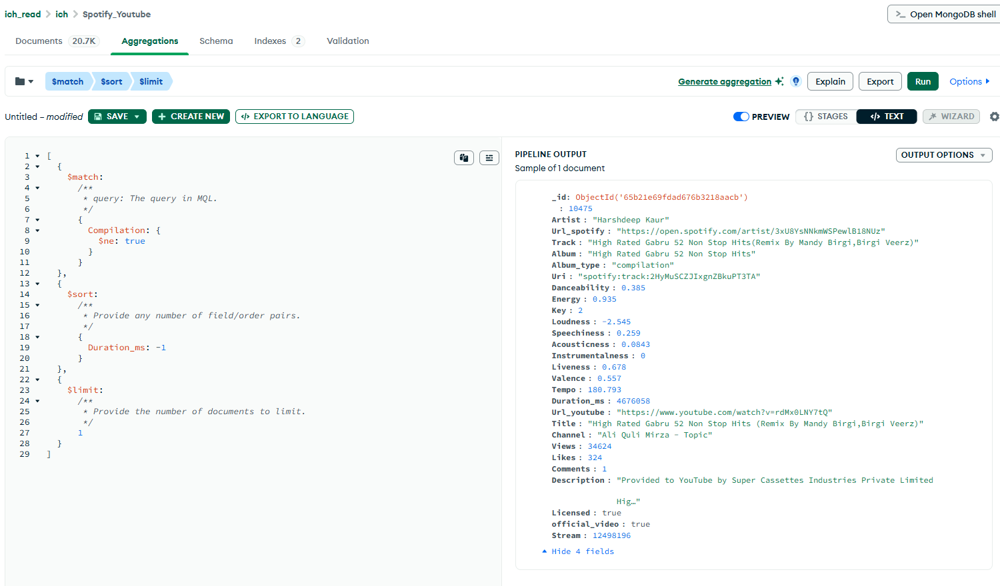
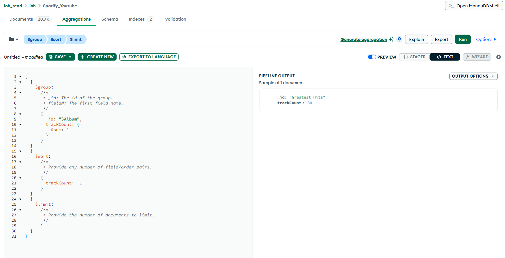
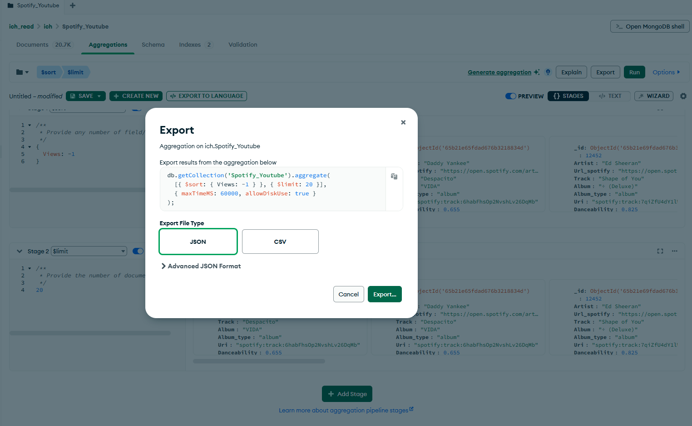
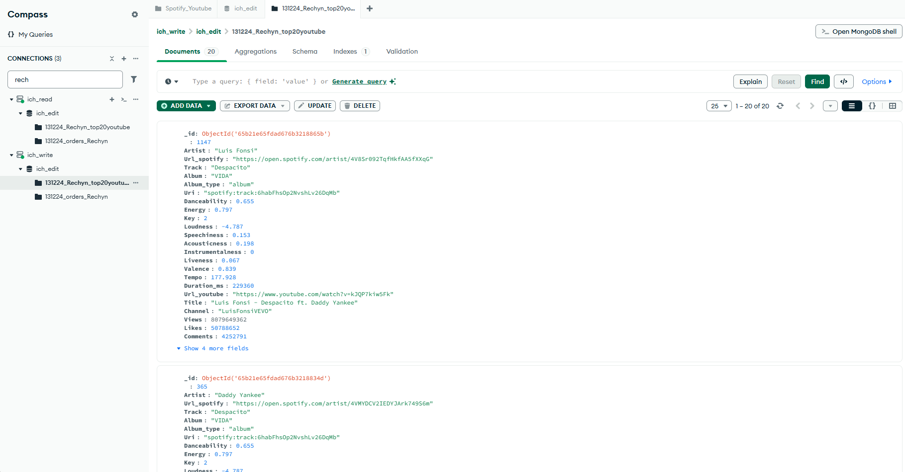
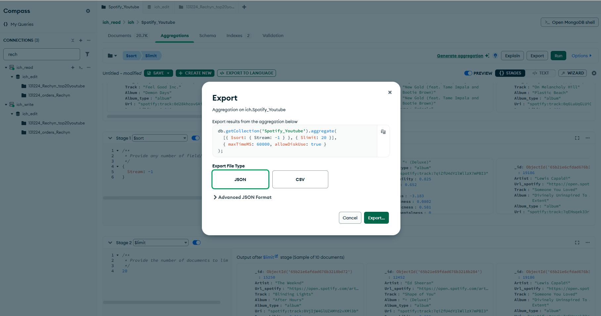
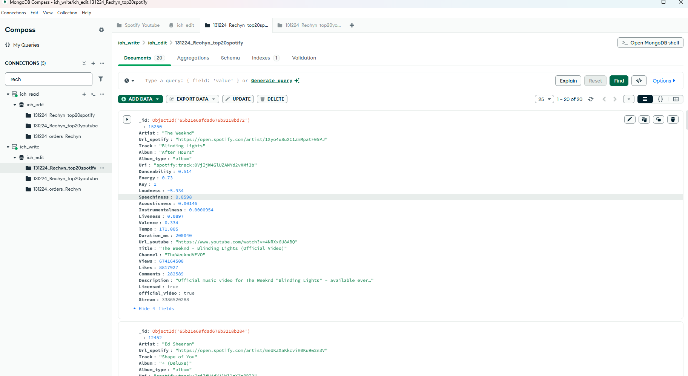

# Web engineering 2025: Домашнее задание 19

## MongoDB. 

### Задание 1. Найдите трек с наивысшими показателями  Danceability и Energy.

### Задание 2. У какого трека (но не compilation) самая большая длительность?

### Задание 3. В каком одном альбоме самое большее количество треков?

### Задание 4. Сколько просмотров видео на youtube у трека с самым высоким количеством прослушиваний на spotify (Stream)? 

### Задание 5. Экспортируйте 20 самых популярных (прослушивания или просмотры) треков по версиям youtube и spotify и импортируйте в базу ich_edit их с именами top20youtube и top20spotify, и добавьте им свои имена для уникальности.

- Экспорт 20 самых популярных (прослушивания или просмотры) треков по версиям youtube

- [Открыть JSON](./ich.Youtube.json)

- импорт в базу данных

- Экспорт 20 самых популярных (прослушивания или просмотры) треков по версиям spotify

- [Открыть JSON](./ich.Spotify.json)

- импорт в базу данных

 

 

 

 

 

2. 